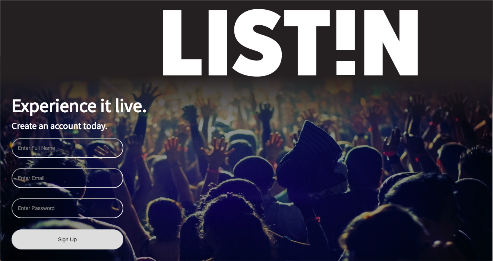
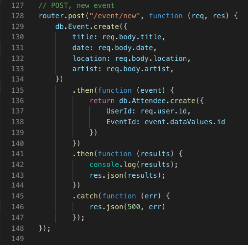
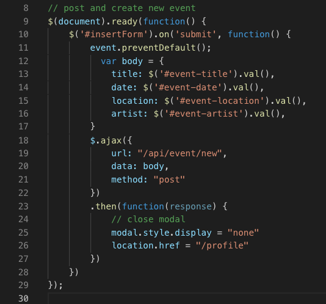

# LIST!N 

LIST!N is an online portal where you can keep track of your favorite artists when they come to town. You may customize your profile and add shows that you would like to see. As more friends join and more shows get added, this information will serve as reminders by populating your newsfeed. 

This is built using Node, Express, Sequelize, JSON Web Tokens, and a MVC Paradigm; for project two of UMN's Coding Bootcamp. 

## Getting Started

First, go to https://project2listen.herokuapp.com/ and on the left-hand side of the webpage, login. If you have not done this already, you may create a username and password, and then you will be redirected to your profile to personalize that with shows you'd like to see. After this is done, you will be redirected to your newsfeed, which will populate with customized data from your profile and other users. 

### Prerequisites

Using this web portal requires no installation, though you may want to have shows in mind that you would like to see [or see again], in order to customize your profile and later generate your newsfeed. 

### How to use locally

1. Direct or `cd` yourself in terminal to a root folder where you'd like to test our project. 
2. Go to https://github.com/HannahSchuelke/ProjectTwo and clone the repository, or type `git clone git@github.com:HannahSchuelke/ProjectTwo.git` into that same root folder.  
3. Type `npm install` also into your terminal from the same folder. 
4. Type `node server.js` into your terminal to start the server.
5. Download MAMP at https://www.mamp.info/en/downloads/, and click to start the server on its popup after install.
6. Download MySQL Workbench at https://dev.mysql.com/downloads/workbench/. Open it and copy/paste our schema.sql file into your workbench. Click to run the code by pressing the far left lightening bolt icon. 
7. Type "http://localhost:8080/" into the URL and you will be able to sign up or sign in and use our online portal intuitively. 

### Notable Code Snippets

These code snippets come from api-routes.js and newEvent.js. They are examples of a many to many relationship that we have in our Sequelize database, and how that updates itself through AJAX calls and CRUD operations. The many to many relationships bridge our users to the shows that they would like to see.

## Repository on Github

https://github.com/HannahSchuelke/ProjectTwo

## Deployment on Github

https://hannahschuelke.github.io/ProjectTwo/

## Deployment on Heroku

https://project2listen.herokuapp.com/

## Built With

* [Bootstrap](https://getbootstrap.com/docs/4.3/getting-started/download/) - The styling framework used
* [npm install](https://docs.npmjs.com/cli/install) - Installs package.json and node.modules that app depends on
* [MAMP](https://www.mamp.info/en/downloads/) - Needed to operate MySQL Workbench
* [MySQL](https://dev.mysql.com/downloads/workbench/) - Needed to handle data

## Authors

* **Jake Scheele** - [jakescheele](https://github.com/jakescheele)
* **Dylan Whipple** - [ProLeon](https://github.com/ProLeon)
* **Case Pollock** - [kietosstarik](https://github.com/kietosstarik)
* **Jennifer Wong** - [jenniferwonguyen](https://github.com/jenniferwonguyen)
* **Emily Casale** - [ercasale97](https://github.com/ercasale97)
* **Hannah Schuelke** - [HannahSchuelke](https://github.com/HannahSchuelke)